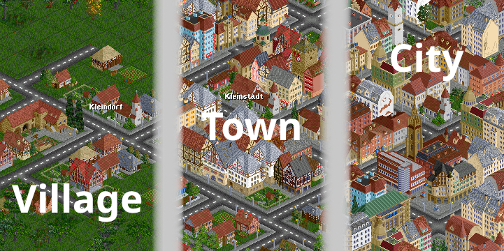

# Central European Towns (CET)

An OpenTTD full houses replacement set that adds house types and sprites in Central European (Austrian, German, Swiss) style to the game.

In addition, CET introduces three town types: Village, Town, and City. Each in-game town will progress through these stages, thereby changing its look and structure.

## Contributors

Graphics by Chataigne, Fraenklie and dant (super_dan). 

Code by dant (super_dan).

Thanks to Andythenorth for his templating tutorial which helped very much in organising the code.

## Main Features

### Town Types
CET aims to simulate the architectural and structural features of real Central European settlements. To achieve this, the set introduces three town types based on an in-game town's population: 

| **Town Type** | **Default Population** |
|:-------------:|:-----------------------|
| Village       | 0 – 1,000              |
| Town          | 1,000 – 10,000         |
| City          | > 10,000               |

The maximum population for villages and towns can be adjusted via parameters (cf. below).

### Features of The Town Types
The three town types regulate what houses can be built in a town and where (in which town zones). Apart from the looks, they influence game play to a limited extent.

* **Villages** are small rural and later suburban settlements. In their centre, churches, schools or inns can appear. However, buildings are generally small as well as the amount of passengers and mail generated.
* **Towns** build larger houses like shops and offices in their centre. Small residential houses move to the outer town zones. Towns build a town hall, and, among other special buildings, one or more larger town churches. Passenger and mail generation increases, goods are more likely accepted.
* **Cities** are densely packed with wall-to-wall buildings. Apart form an old town district in their centre, they are dominated by block perimeter development throughout the innermost town zone. They build a city hall and cathedrals, as well as multi-tile city parks and large office buildings near station infrastructure.

### Historical Eras
The set introduces six historical eras to help changing the look of in-game towns based on real architectural history.

Their default start and end dates are:
* 1700 – 1849: Era 01 (Old town generation in cities)
* 1850 – 1919: Era 02 (Historistic ring generation in cities)
* 1920 – 1949: Era 03
* 1950 – 1979: Era 04
* 1980 – 2009: Era 05
* 2010 – 9999: Era 06

During the first two eras to special districts form in towns and cities, the old town district and later a ring of (late 19th century historism-inspired) block perimeter development houses, called "historistic rings". In order to better suit later game starts, the end of era 01 can be adjusted (cf. "Parameters").

### Old Town Districts and Historistic Rings
Town and city houses built prior to 1920 can become protected within one of these zones to increase the diversity of the in-game towns.

* Town houses built before 1920 can become protected and form a town's old town district. In cities, these old town houses no longer appear as soon as era 02 block perimeter development begins.
* Town and city houses built up to 1850 become protected after that year when located in a three-tile raidius around a town hall, church or town church.
* From era 02 onwards, cities build wall-to-wall block perimeter houses in the innermost town zone. The ones built up to 1920 become protected after that year when located within a radius of three tiles around the old town district.
* If the houses enabling protection (town hall, church, town church) are demolished by the player, the old town district and, in consequence, its surrounding historicist ring disappear, unless these house types are rebuilt close-by.
* If a village becomes a town only after 1919, no old town district or historistic ring will appear in it. 
* A game with a start year later than 1919 will see no old town districts or historistic rings either.

### City Parks
In cities larger park areas can be build in multiple locations.

* The first couple of city park tiles appear randomly. 
* Consecutive park tiles are exclusively built next to others, so that larger park areas form automatically.
* City park tiles are protected from auto-removal by the game.
* The spread of the park areas is limited only by the road network. Thus, if players want to 'grow' a city park, they can adjust the roads to make for bigger spaces in between them.

### Conditions for Certain House Types
Some house types have special (proximity) conditions for them to be built.

* Hotels and grand hotels (multi-tile hotels) need station infrastructure or special house types (city hall, cathedral, city park) to be built. They appear only when at least three station tiles or one tile of a special house type (such as cathedrals or other 'tourist locations') are present in a radius of three tiles around their building tile.
* Office buildings and skyscrapers need a higher station density. They, too, check for the presence of at least three station tiles in a radius of three tiles around their building tile.

### Parameters
The set introduces the following parameter settings:

1. **Town minimum population**: Increase or decrease the maximum population needed for a village to transition into a town. For smaller maps, it is recommended to decrease this value as villages contain many two-tile small farms. Thus, they can grow quite a bit in size while still having little population.
2. **City minimum population**: Increase or decrease the maximum population needed for a town to turn into a city. As with villages, the higher this value is set, the more spacious towns grow before becoming cities.
3. **Disable default OpenTTD houses**: This is activated by default. Disable this parameter if you want the default OpenTTD houses to appear alongside the set's own houses.
4. **First historical era end year**: This parameter sets the start year for the set's second historical era (cf. above). Possible values range from 1850 to 1890. This date is important for old town districts, as they can no longer grow afterwards. In addition, after this date cities exclusively build block perimeter houses in their innermost town zone (apart from special buildings). To accomodate for games with start years between 1850 to 1880, this date should be adjusted, if you want to experience the full set of graphics CET has to offer.
5. **Enable historistic rings**: If enabled, the historistic rings (cf. above) will appear around a city's old town district (if there is one). If disabled, all era 02 buildings will later be replaced by newer ones with more modern style.

### Code Reference

All code is thoroughly commented. For better handling, the main nml file has been split into pnml files for each house type, the header, and the set's functions. The main nml file is compiled by the help of the 'makenml' python script. All data is provided in /src/ (https://github.com/danttt/Central-European-Towns).